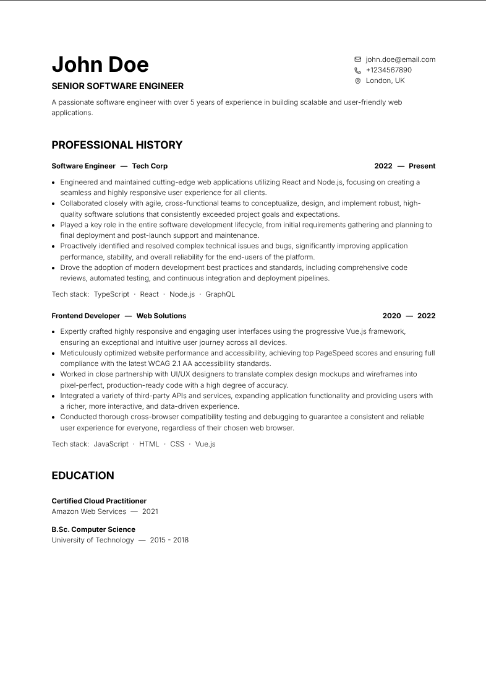

# MYCV - My Digital Curriculum Vitae

Tired of wrestling with clunky online resume builders that sell your data and produce bloated PDF files? Say hello to MYCV, your self-hosted, document-driven, and endlessly personalisable curriculum vitae solution.



## Why MYCV?

*   **Self-Hosted & Private**: Your data is yours. MYCV runs on your machine. No cloud, no tracking, no giving your personal information to third-party services.
*   **Document-Driven**: All content is managed through simple Markdown files. If you can write a list, you can create a beautiful CV. No need to be a web developer.
*   **Infinitely Personalizable**: You have the keys to the kingdom. Since you have the source code, you can change anything you want, from the font to the layout. Make it truly yours.
*   **Feather-light Footprint**: Word processors can spit out PDFs that are several megabytes large, often tripping up online job application forms with size limits. MYCV generates a lightweight, clean PDF. My own CV is a svelte ~150 KB.
*   **AI & Human Readable**: The output is clean HTML, making it easily scannable by the AI resume screeners that are increasingly common, while still being pleasant for human eyes.
*   **Version Controlled**: Built on a foundation of plain text files, your CV can be version controlled with Git. Track changes, revert to previous versions, and never fear losing your work again.

## Content Instructions

All your CV's content lives in the `src/content/` folder. It's just a collection of Markdown files.

*   `src/content/meta/index.md`: Personalize your name, email, phone number, and links to your online profiles (like LinkedIn or GitHub).
*   `src/content/intro/index.md`: This is your elevator pitch. Write a compelling introduction about yourself.
*   `src/content/jobs/`: Add your work experience here. Create one file per job. I suggest prefixing filenames with numbers (e.g., `01_first-job.md`, `02_second-job.md`) to keep them in chronological order.
*   `src/content/studies/`: Detail your education and certifications here. Like with jobs, create one file per item and use numbered prefixes to control the order.

## Personalization Instructions

Want to tweak the look and feel?

*   **Styling**: To change fonts, colors, or sizes, dive into `src/pages/index.astro`. You'll find the CSS right at the top in a `<style>` block.
*   **Printing**: To adjust the PDF output, like margins and paper size, edit `src/layouts/printable.astro`.

## How to Run

1.  **Run Locally**:
    ```sh
    npm install
    npm run dev
    ```
    This will install dependencies and start a local development server. You can view your CV at `http://localhost:4321`.

2.  **Print to PDF**:
    *   Click the "Print" button on the page or press `CTRL+P` (or `CMD+P` on Mac).
    *   In the print dialog, make sure to set the destination to "Save as PDF".
    *   For the best results, disable headers and footers and set margins to "None".
